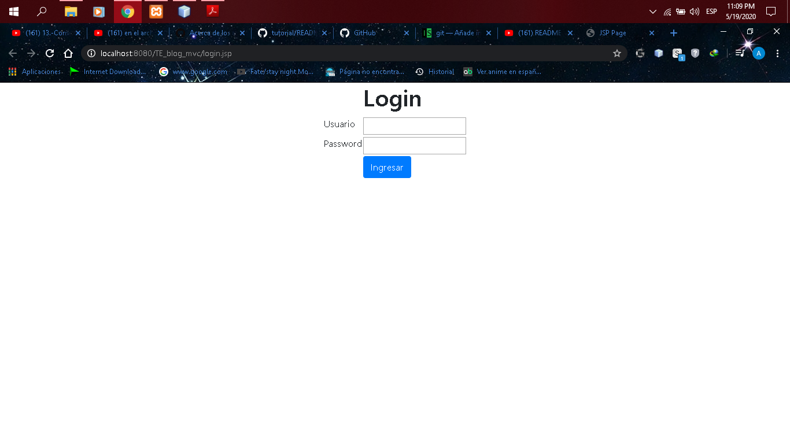
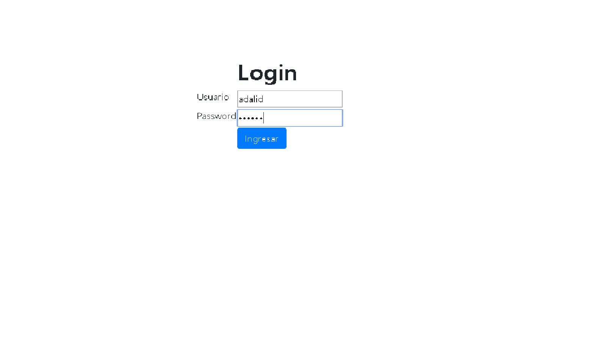
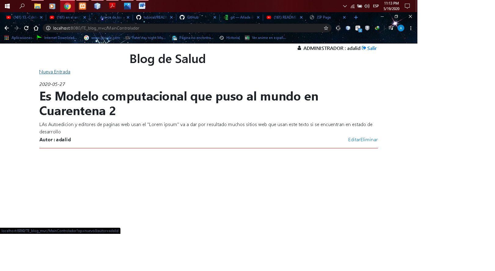
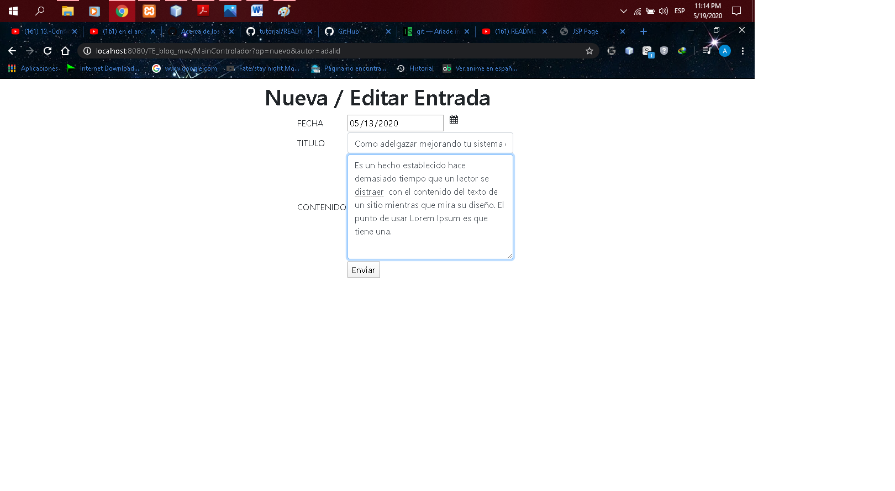
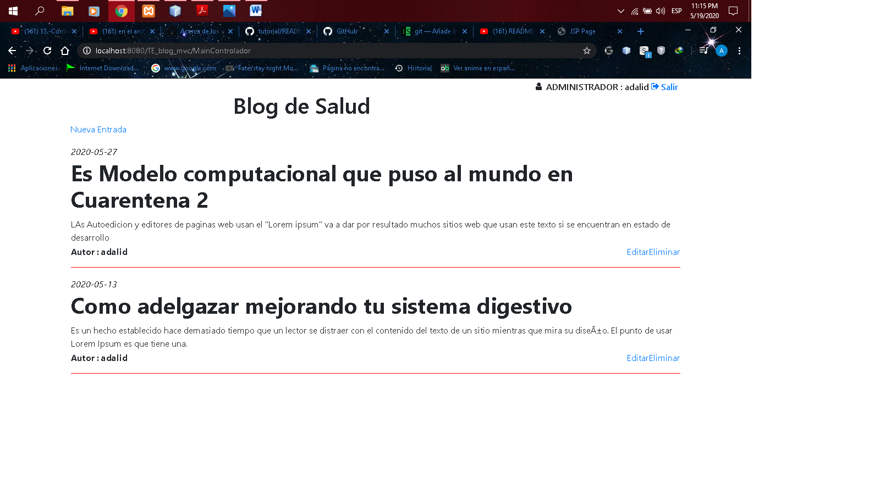

# Mi Aplicacion en netbeas

Desarrollar una aplicación Web para gestionar un Blog. 
La aplicación cuenta con una página  de 
autenticación de usuario que debe ser verificada 
en una tabla de la base de datos.

Realizado por : Adalid Roman Gutierrez Flores
CARRERA: INGENIERIA DE SISTEMAS
MATERIA : TECNOLOGIAS EMERGENTES II

BASE DE DATOS:
bd_blog.sql

Imagenes :

